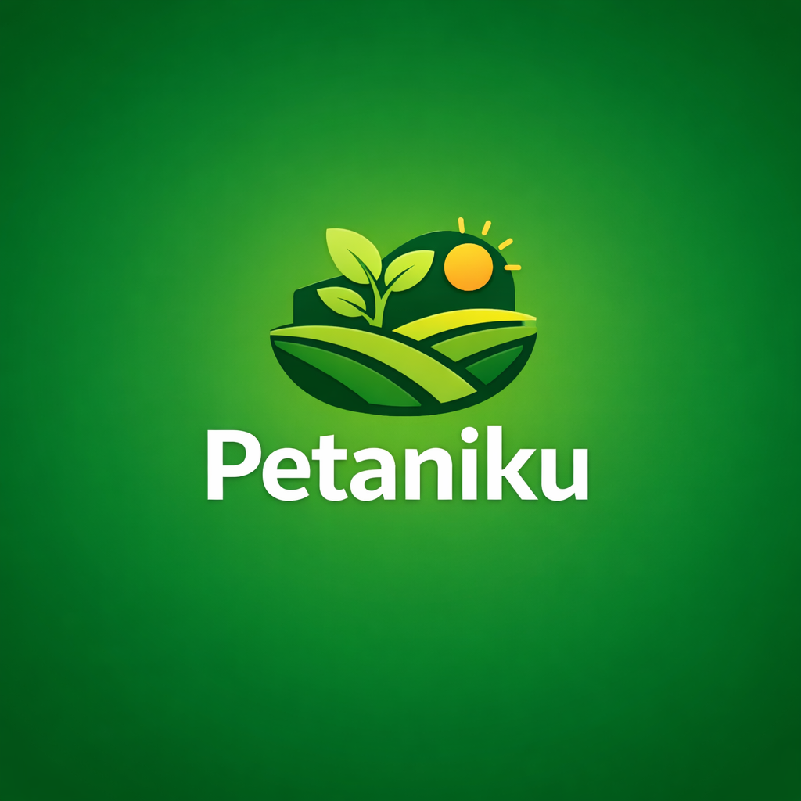

# Petaniku 🌱



## 📋 Project Overview

**Petaniku** is an innovative web platform that directly connects buyers with farmers, eliminating intermediaries in the agricultural supply chain. This platform enables more transparent transactions, fairer prices, and closer relationships between consumers and producers.

**Status:** 🚧 Under Development (Beta)

## ✨ Key Features

### 👥 For Buyers

- ✅ **Authentication** - Login/Register system
- 🏠 **Landing Page** - Engaging homepage
- 📦 **Product Catalog** - Display of various fresh vegetables
- 🔍 **Search & Filter** - Easy product discovery
- 🛒 **Shopping Cart** - Complete cart system
- 💬 **Real-time Chat** - Direct communication with farmers via WebSocket
- 📝 **Checkout** - Secure purchase process
- 👤 **User Profile** - Manage personal data

### 👨‍🌾 For Sellers (Farmers)

- ✅ **Authentication** - Farmer-specific login/register
- 📊 **Product CRUD** - Manage vegetable listings (Create, Read, Update, Delete)
- 💬 **Real-time Chat** - Respond to buyer messages
- 🔔 **Notifications** - Receive real-time alerts
- 👤 **Farmer Profile** - Display farmer information
- 📈 **Dashboard** - Manage products and orders

## 🛠️ Technology Stack

### Frontend

- **React** - JavaScript library for UI
- **TypeScript** - Type safety and developer experience
- **Tailwind CSS** - Utility-first CSS framework
- **Framer Motion** - Smooth animations
- **React Router DOM** - Client-side navigation
- **Axios** - HTTP client

### Backend

- **Express.js** - Node.js framework
- **PostgreSQL** - Relational database
- **Sequelize** - ORM for PostgreSQL
- **WebSocket** - Real-time communication
- **Multer** - File upload handling
- **bcryptjs** - Password encryption
- **CORS** - Cross-origin resource sharing

### Deployment & Infrastructure

- **Docker** - Containerization
- **Docker Compose** - Multi-container orchestration
- **Alibaba Cloud** - Cloud hosting
- **CentOS** - Server operating system

## 🚀 Installation & Running the Project

### Prerequisites

- Node.js (v16 or newer)
- Docker & Docker Compose
- PostgreSQL (if running without Docker)
- npm or yarn

### 1. Clone Repository

```bash
git clone https://github.com/satellacodes/petaniku.git
cd petaniku
```

### 2. Backend Setup

```bash
cd backend
cp .env.example .env
# Edit .env with your database configuration
npm install
npm run dev
```

### 3. Frontend Setup

```bash
cd frontend
npm install
npm start
```

### 4. Using Docker (Recommended)

```bash
# From root project
docker-compose up --build
```

Application will be available at:

- Frontend: http://localhost:3000
- Backend API: http://localhost:5000
- Database: PostgreSQL on port 5432

## 📁 Project Structure

```
petaniku/
├── frontend/                 # React TypeScript frontend
│   ├── src/
│   │   ├── components/      # Reusable components
│   │   ├── pages/          # Application pages
│   │   ├── services/       # API calls
│   │   ├── types/          # TypeScript definitions
│   │   └── utils/          # Utility functions
│   ├── public/
│   └── package.json
├── backend/                  # Express.js backend
│   ├── src/
│   │   ├── controllers/    # Logic controllers
│   │   ├── models/         # Database models
│   │   ├── routes/         # API routes
│   │   ├── middleware/     # Custom middleware
│   │   └── utils/          # Utility functions
│   └── package.json
├── docker-compose.yml       # Docker configuration
├── database/                # Database scripts
├── assets/                  # Images and assets
└── README.md
```

## 🎯 Available Pages

1. **Home** - Landing page with platform information
2. **About** - About Petaniku and our mission
3. **Product List** - Product catalog with filters
4. **Product Detail** - Complete product details
5. **Profile** - User profile (buyer/farmer)
6. **Farmer Profile** - Specialized farmer profile
7. **Cart** - Shopping cart
8. **Checkout** - Payment process
9. **Chat** - Real-time chat room
10. **Farmer Dashboard** - Manage products (CRUD)
11. **404 Not Found** - Error page

## 📦 Package Publishing

### Beta Version

```
PetaniKu Web App v0.1.0-beta
- Frontend Package: @petaniku/web
- Backend Package: @petaniku/api
```

### NPM Packages

```json
{
  "frontend": {
    "name": "@petaniku/web",
    "version": "0.1.0-beta",
    "private": true
  },
  "backend": {
    "name": "@petaniku/api",
    "version": "0.1.0-beta",
    "private": true
  }
}
```

## 🔄 Releases

### Beta Releases

- **v0.1.0-beta** - Initial release with basic features
- **v0.2.0-beta** - WebSocket chat & notifications addition
- **v0.3.0-beta** - Product CRUD for farmers

## 🤝 Contributing

We welcome contributions! Please read [CONTRIBUTING.md](./CONTRIBUTING.md) for a complete guide on how to contribute to this project.

### How to Contribute

1. Fork the repository
2. Create a feature branch (`git checkout -b feature/featurename`)
3. Commit your changes (`git commit -m 'Add feature X'`)
4. Push to the branch (`git push origin feature/featurename`)
5. Create a Pull Request

## 🐛 Reporting Bugs

If you find a bug, please open an [issue](https://github.com/satellacodes/petaniku/issues) with the provided template.

## 📄 License

This project is licensed under the MIT License - see the [LICENSE](./LICENSE) file for details.

## 📞 Contact

**Petaniku Development Team**

- Email: dimasarisp52@gmail.com
- Website: https://petaniku.vercel.app

## 🙏 Acknowledgments

Thank you to all contributors and parties who have supported the development of Petaniku. May this platform help Indonesian farmers and provide better access to fresh agricultural products.

---

**Note:** This project is under active development. Features and documentation may change over time.

---

<div align="center">
  <p>Built with ❤️ for Indonesian farmers</p>
</div>
